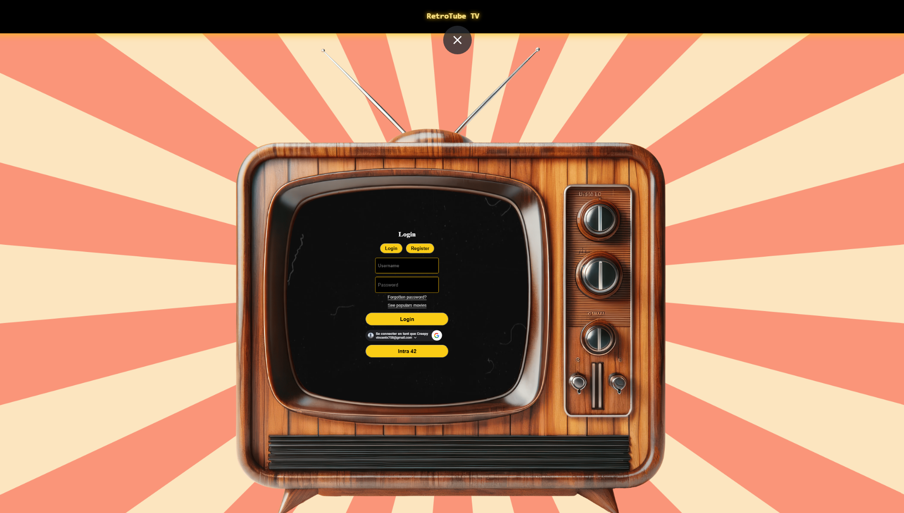
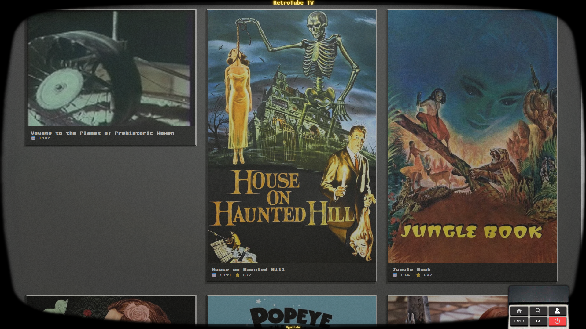
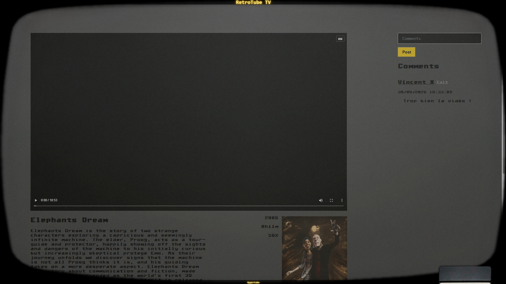
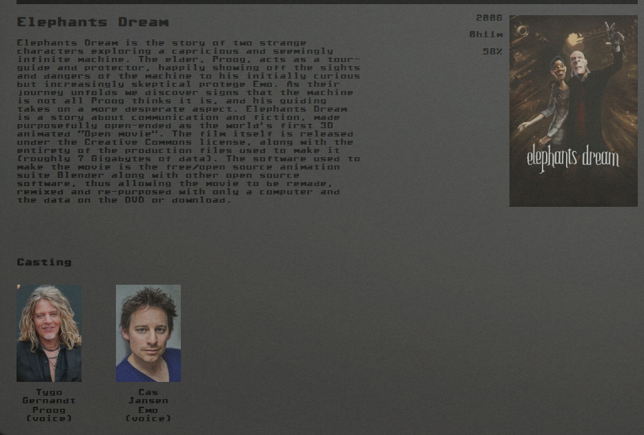
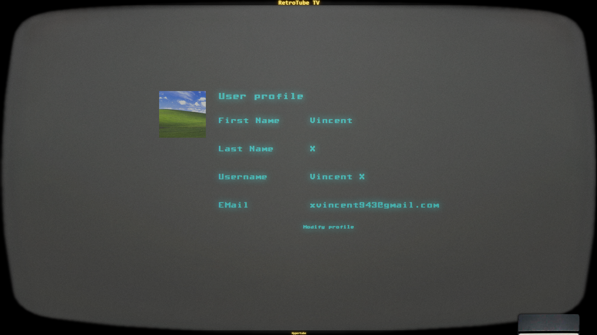
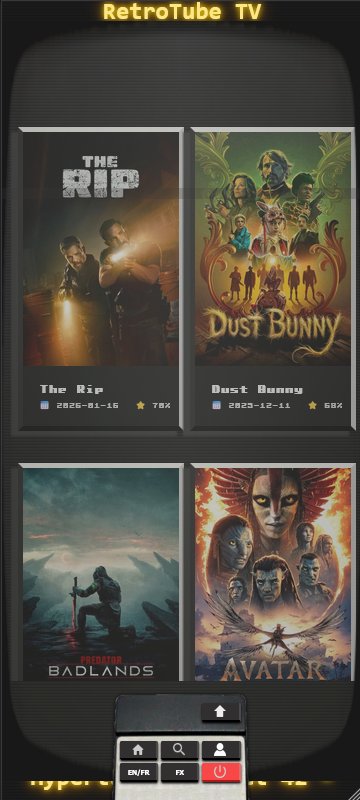

# Hypertube

> A web application to search and stream videos, built as a project of the 42 curriculum.

## Overview

Hypertube is a full-stack web app made of a **React** frontend and a **FastAPI** backend, backed by a **PostgreSQL** database running in Docker. The frontend talks to the API through a dev proxy, and a WebSocket channel allows real-time communication with the server.

## Screenshots

<p align="center">
  
  
	
	
	
	
</p>

## Tech Stack

| Layer | Technology |
|-------|------------|
| Frontend | React, Vite |
| Backend | Python, FastAPI |
| Database | MariaDB (Docker) |
| Real-time | WebSocket |
| Tooling | Docker, Python venv |

## Getting Started

### Prerequisites

- Python 3 and `pip`
- Node.js and npm
- Docker

### Installation

```bash
git clone <repo-url>
cd hypertube

# Backend
python -m venv venv
source venv/bin/activate        # Windows: venv\Scripts\activate
pip install -r requirements.txt

# Frontend
cd app/frontend
npm install
```

### Run in development

From the project root, launch the dev servers with:

```bash
python run_dev.py
```

The frontend runs on `http://localhost:5173` and proxies every `/api` request to the backend on `http://127.0.0.1:8000`.
